# 🎵 EvenBiz Music Platform - Technical Assessment

A Rails 8.1 music platform featuring a REST API for releases management, with a monolith web interface for CRUD operations and an interactive API Explorer.

## 📋 Table of Contents

- [Quick Start](#-quick-start)
- [Assessment Compliance](#-assessment-compliance)
- [Architecture Overview](#-architecture-overview)
- [Design Rationale](#-design-rationale)
- [Query Optimization & N+1 Prevention](#-query-optimization--n1-prevention)
- [Separation of Concerns](#-separation-of-concerns)
- [API Documentation](#-api-documentation)
- [Environment Configuration](#-environment-configuration)
- [Running Tests](#-running-tests)
- [Trade-offs & Decisions](#-trade-offs--decisions)

---

## 🚀 Quick Start

### Prerequisites

- Docker & Docker Compose
- Git

### Setup

```bash
# Clone the repository
git clone <repository-url>
cd evenbiz-technical-assesment

# Copy environment file
cp .env.docker .env

# Start the application
docker compose up --build

# In a new terminal, setup the database
docker compose exec web rails db:create db:migrate db:seed
```

The application will be available at: **http://localhost:8080**

### Default Credentials

| Type | Value |
|------|-------|
| Email | `admin@evenbiz.test` |
| Password | `password123` |
| API Token | Displayed after seeding |

---

## ✅ Assessment Compliance

### Requirements Checklist

| Requirement | Status | Implementation |
|-------------|--------|----------------|
| **GET `/api/releases` endpoint** | ✅ | `Api::ReleasesController#index` |
| **JSON format (id, name, album, artists, dates, duration)** | ✅ | `ReleaseBlueprint` serializer |
| **`past=1` filter (past releases)** | ✅ | `Release.past` scope |
| **`past=0` filter (upcoming releases)** | ✅ | `Release.upcoming` scope |
| **No param (all releases)** | ✅ | Default behavior |
| **Default 10 records per page** | ✅ | `ListService::DEFAULT_PER_PAGE` |
| **`limit` parameter support** | ✅ | Custom pagination |
| **Pagination metadata** | ✅ | `PaginationMeta` value object |
| **20+ artists** | ✅ | Seeds create 25 artists |
| **50+ releases** | ✅ | Seeds create 100 releases |
| **Each release → one album** | ✅ | `has_one :album` |
| **Each album → artist + duration** | ✅ | `belongs_to :artist` + duration field |
| **Multiple artists per release** | ✅ | `artist_releases` join table |
| **Featured artists (collaborations)** | ✅ | 40% of releases have 1-3 featured artists |

### API Response Format

```json
{
  "data": [
    {
      "id": 1,
      "name": "Sound Music",
      "album": {
        "name": "Sound Music - Single",
        "cover_url": "https://..."
      },
      "artists": [
        {
          "id": 1,
          "name": "Jane D",
          "logo_url": "https://..."
        }
      ],
      "created_at": "2021-01-22T12:34:56-06:00",
      "released_at": "2021-01-24T04:00:00-06:00",
      "duration_in_minutes": 55
    }
  ],
  "meta": {
    "current_page": 1,
    "total_pages": 10,
    "total_count": 100,
    "per_page": 10
  }
}
```

---

## 🏗 Architecture Overview

> **📌 Note:** The diagrams below use [Mermaid](https://mermaid.js.org/) syntax. They render automatically on GitHub. For local viewing in VS Code, install the [Markdown Preview Mermaid Support](https://marketplace.visualstudio.com/items?itemName=bierner.markdown-mermaid) extension.

### System Architecture


### Request Flow


---

## 🎯 Design Rationale

### Why This Architecture?


### Layer Responsibilities

| Layer | Responsibility | Example |
|-------|---------------|---------|
| **Controllers** | HTTP concerns only (params, status codes, responses) | `Api::ReleasesController` |
| **Services** | Business logic, orchestration, query building | `Releases::ListService` |
| **Models** | Data integrity, associations, query scopes | `Release.for_index` |
| **Blueprints** | JSON serialization, presentation logic | `ReleaseBlueprint` |
| **Value Objects** | Immutable data structures | `PaginationMeta`, `ServiceResult` |

---

## ⚡ Query Optimization & N+1 Prevention

### Strategy: Eager Loading with Query Planners

```mermaid
graph LR
    subgraph Without Optimization
        A1[Release.all] --> B1[N queries for albums]
        B1 --> C1[N queries for artists]
        C1 --> D1[N queries for attachments]
        D1 --> E1[💥 100+ queries]
    end

    subgraph With Query Planners
        A2[Release.for_index] --> B2[1 query with includes]
        B2 --> E2[✅ 3-4 queries total]
    end
```



### Implementation

```ruby
# app/models/release.rb
scope :for_index, lambda {
  includes(
    album: { cover_attachment: :blob },
    artists: { logo_attachment: :blob }
  ).order(released_at: :desc, name: :asc)
}
```

### Query Analysis

| Operation | Without Optimization | With `for_index` |
|-----------|---------------------|------------------|
| List 100 releases | ~300 queries | 4 queries |
| With search | ~400 queries | 5 queries |
| With filters | ~350 queries | 4 queries |

---

## 🧩 Separation of Concerns

### Controller Layer (Thin Controllers)

```ruby
# Controllers only handle HTTP concerns
class Api::ReleasesController < BaseController
  def index
    result = Releases::ListService.call(params: sanitized_params)
    respond_with_result(result, serializer: ReleaseBlueprint)
  end
end
```

### Service Layer (Business Logic)

```ruby
# Services encapsulate business logic
class Releases::ListService < BaseService
  def call
    releases = build_query
    paginated, meta = paginate(releases, page: @page, per_page: @per_page)
    success(data: paginated, meta: meta)
  end

  private

  def build_query
    scope = Release.for_index
    scope = apply_past_filter(scope)
    scope = apply_search(scope)
    scope
  end
end
```

### Model Layer (Query Scopes)

```ruby
# Models define reusable query patterns
class Release < ApplicationRecord
  scope :for_index, -> { includes(...).order(...) }
  scope :past, -> { where(released_at: ...Time.current) }
  scope :upcoming, -> { where(released_at: Time.current..) }
end
```

### Serialization Layer (Blueprints)

```ruby
# Blueprints handle JSON structure
class ReleaseBlueprint < ApplicationBlueprint
  identifier :id
  field :name
  association :album, blueprint: AlbumBlueprint
  association :artists, blueprint: ArtistBlueprint
  field :duration_in_minutes
end
```

---

## 📡 API Documentation

### Releases API

#### List Releases

```bash
GET /api/releases
Authorization: Bearer <token>
```

**Query Parameters:**

| Parameter | Type | Default | Description |
|-----------|------|---------|-------------|
| `page` | integer | 1 | Page number |
| `limit` | integer | 10 | Records per page (max: 100) |
| `past` | boolean | - | `1` = past releases, `0` = upcoming |
| `search` | string | - | Fuzzy search across releases, albums, artists |

**Examples:**

```bash
# Get all releases (paginated)
curl -H "Authorization: Bearer <token>" http://localhost:8080/api/releases

# Get past releases
curl -H "Authorization: Bearer <token>" http://localhost:8080/api/releases?past=1

# Get upcoming releases with custom limit
curl -H "Authorization: Bearer <token>" http://localhost:8080/api/releases?past=0&limit=20

# Search releases
curl -H "Authorization: Bearer <token>" http://localhost:8080/api/releases?search=thriller
```

---

## 🔧 Environment Configuration

### `.env` Example

```dotenv
# PostgreSQL Configuration
POSTGRES_HOST=db
POSTGRES_USER=postgres
POSTGRES_PASSWORD=postgres
POSTGRES_DB=evenbiz_technical_assesment_development
POSTGRES_PORT=54322

# Rails Configuration
RAILS_ENV=development
RAILS_PORT=8080
SECRET_KEY_BASE=your_secret_key_base_at_least_64_characters_long

# Optional: For encrypted credentials
# RAILS_MASTER_KEY=your_master_key_here
```

### `.env.docker` (Template)

```dotenv
# Docker Compose Environment Variables
# Copy this file to .env and adjust as needed

# PostgreSQL Configuration
POSTGRES_HOST=db
POSTGRES_USER=postgres
POSTGRES_PASSWORD=postgres
POSTGRES_DB=evenbiz_technical_assesment_development
POSTGRES_PORT=54322

# Rails Configuration
RAILS_ENV=development
RAILS_PORT=8080
SECRET_KEY_BASE=development_secret_key_base_at_least_64_bytes_long_for_security_purposes

# Optional: Set this if you need to decrypt credentials in development
# RAILS_MASTER_KEY=your_master_key_here
```

### Docker Services

| Service | Port | Description |
|---------|------|-------------|
| `web` | 8080 | Rails application |
| `db` | 54322 | PostgreSQL 17 |

---

## 🧪 Running Tests

```bash
# Run all tests
docker compose exec web bundle exec rspec

# Run with documentation format
docker compose exec web bundle exec rspec --format documentation

# Run specific test files
docker compose exec web bundle exec rspec spec/requests/
docker compose exec web bundle exec rspec spec/services/

# Run RuboCop
docker compose exec web bundle exec rubocop
```

### Test Coverage

| Category | Examples | Description |
|----------|----------|-------------|
| Request Specs | 87 | API endpoints, controllers |
| Service Specs | 87 | Business logic, search |
| Model Specs | 55 | Validations, associations |
| **Total** | **229** | All passing ✅ |

---

## ⚖️ Trade-offs & Decisions

### 1. Blueprinter vs JBuilder/ActiveModelSerializers

| Option | Pros | Cons | Decision |
|--------|------|------|----------|
| **Blueprinter** ✅ | Fast, declarative, explicit | Less Rails-native | **Chosen**: Performance + clarity |
| JBuilder | Rails default, template-based | Slower, implicit | Rejected |
| AMS | Popular, JSON:API support | Maintenance concerns | Rejected |

### 2. Service Objects vs Fat Controllers

| Option | Pros | Cons | Decision |
|--------|------|------|----------|
| **Service Objects** ✅ | Testable, reusable, SRP | More files | **Chosen**: Maintainability |
| Fat Controllers | Fewer files | Hard to test, violates SRP | Rejected |

### 3. SQL Fuzzy Search vs Elasticsearch

| Option | Pros | Cons | Decision |
|--------|------|------|----------|
| **SQL ILIKE** ✅ | Simple, no dependencies | Limited features | **Chosen**: Fits scope |
| Elasticsearch | Powerful, scalable | Complexity, infrastructure | Over-engineering |
| pg_trgm | Better fuzzy matching | Extension dependency | Future enhancement |

### 4. Session + Token Auth vs OAuth

| Option | Pros | Cons | Decision |
|--------|------|------|----------|
| **Dual Auth** ✅ | Appropriate per context | Two systems | **Chosen**: Best UX per client |
| OAuth only | Standard, SSO ready | Complex for assessment | Over-engineering |
| Session only | Simple | Not suitable for API | Incomplete |

### 5. Docker Compose vs Local Setup

| Option | Pros | Cons | Decision |
|--------|------|------|----------|
| **Docker Compose** ✅ | Reproducible, isolated | Docker required | **Chosen**: Easy setup |
| Local only | No Docker needed | "Works on my machine" | Rejected |

### 6. Monolith + API vs Separate Services

| Option | Pros | Cons | Decision |
|--------|------|------|----------|
| **Unified App** ✅ | Simple deployment, shared code | Coupling | **Chosen**: Right-sized |
| Microservices | Independence, scaling | Complexity | Over-engineering |

---

## 📁 Project Structure

```
app/
├── blueprints/          # JSON serializers
│   ├── application_blueprint.rb
│   ├── release_blueprint.rb
│   ├── album_blueprint.rb
│   └── artist_blueprint.rb
├── controllers/
│   ├── api/             # API controllers (token auth)
│   │   ├── base_controller.rb
│   │   └── releases_controller.rb
│   ├── concerns/        # Shared controller logic
│   └── *.rb             # Monolith controllers (session auth)
├── models/
│   ├── release.rb       # Query scopes: for_index, past, upcoming
│   ├── album.rb
│   ├── artist.rb
│   └── artist_release.rb
├── services/
│   ├── base_service.rb  # Shared patterns
│   ├── releases/
│   │   └── list_service.rb
│   ├── search/
│   │   ├── artists_search.rb
│   │   ├── albums_search.rb
│   │   └── releases_search.rb
│   └── api/
│       └── http_client.rb
└── value_objects/
    ├── pagination_meta.rb
    └── service_result.rb
```

---

## 🙏 Acknowledgments

Built with:
- Ruby 4.0.1 / Rails 8.1.2
- PostgreSQL 17
- Docker Compose
- RSpec + WebMock
- Blueprinter
- Dry-Struct / Dry-Types
- TailwindCSS

---

## 📝 License

This project is part of a technical assessment for EvenBiz.
